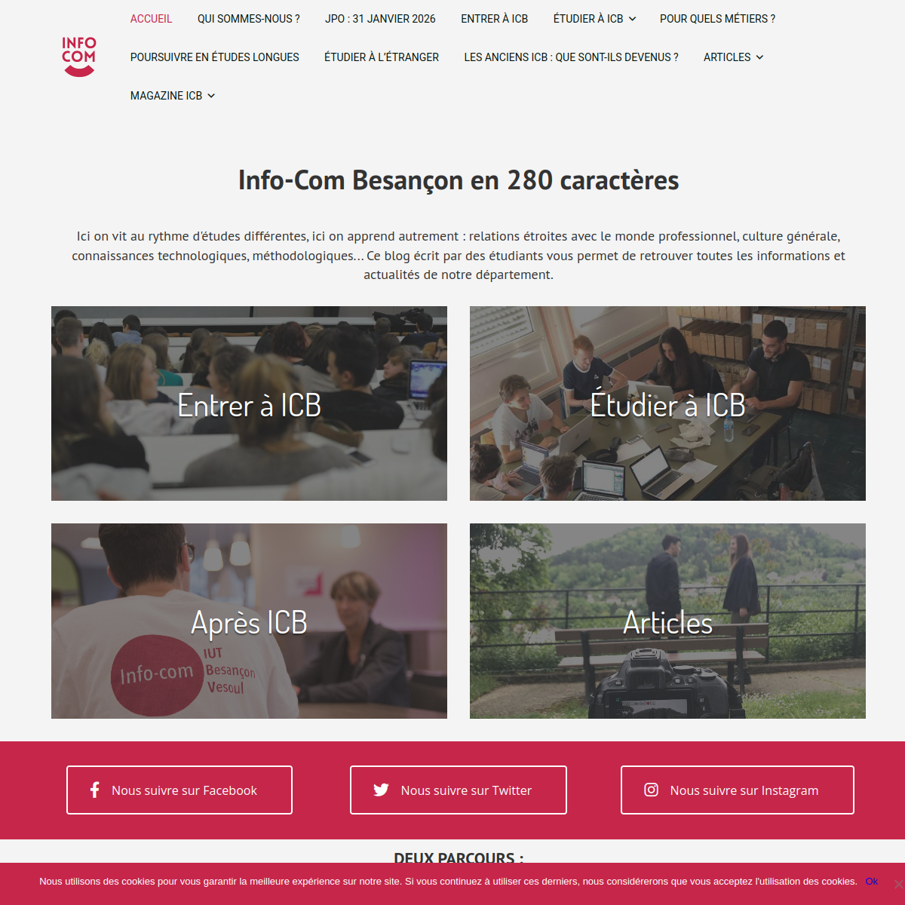

---
hide:
  - navigation
---
Le projet a déjà commencé, n'hésitez pas à poser des questions et à vous **organiser**. *Pause possible si besoin.*
# Le site actuel

[infocombesancon.fr](https://infocombesancon.fr) est le site existant que ce projet a pour mission de refondre.

*Capture d'écran de la page d'accueil actuelle*

## Ce que l'on sait déjà

Le site a été réalisé avec un **ancien builder WordPress** (qu'il faudra certainement conserver pour que les anciennes pages s'affichent correctement).

!!! note "Pourquoi changer de builder ?"
    Un builder daté pose en général plusieurs problèmes cumulés : code généré peu optimisé, difficulté à maintenir un rendu responsive cohérent, options de mise en page limitées, et parfois des risques de sécurité si le builder n'est plus maintenu. La refonte vise à migrer vers **Elementor**, plus largement utilisé et mieux documenté pédagogiquement pour un BUT Information-Communication.

## Ce qu'il faudra vérifier en équipe

Dès le démarrage du projet, l'équipe devra documenter précisément :

- Quel builder/thème WordPress est utilisé actuellement
- La version de WordPress et des plugins installés
- Le nombre de pages et d'articles existants
- Les éventuelles fonctionnalités spécifiques (formulaires, annuaire, agenda, etc.)

Ces constats techniques alimenteront l'[Audit du site existant](../03-analyse-prealable/audit-existant.md).

## Qui est concerné

Le site représente le département Information-Communication. Avant d'aller plus loin, l'équipe doit clarifier qui sont les parties prenantes du site (porteurs du projet, futurs administrateurs du site une fois la refonte livrée, etc.) — voir [Cibles et objectifs](../03-analyse-prealable/cibles-objectifs.md).

## Constats

Premiers problèmes identifiés sur le site actuel, à vérifier et compléter par l'équipe en début de projet.

### Organisation des contenus

Le site nécessite une réorganisation de ses contenus. Pistes à creuser par l'équipe :

- L'arborescence actuelle est-elle compréhensible pour un visiteur qui découvre le site ?
- Y a-t-il des pages orphelines, en doublon, ou obsolètes ?
- Les contenus les plus importants (ex : candidater, contacter, programme de formation) sont-ils accessibles en 1-2 clics depuis l'accueil ?

!!! tip "Méthode suggérée"
    Faire un **inventaire de contenu**  : lister toutes les pages existantes dans un tableau, avec pour chacune son URL, son objectif supposé, et une proposition (garder / fusionner / supprimer / réécrire). Ce travail nourrit directement la page [Audit du site existant](../03-analyse-prealable/audit-existant.md).

!!! warning "Site en production"
	Les contenus du site vont continuer à évoluer pendant votre refonte, les Team 2.0 et JPO devraient publier des informations sur le site cette année. Il faudra prendre contact avec ces 2 équipes de projet tuteuré pour mettre en place des process et éviter de perdre des informations.

### Aspect visuel / builder

- Le design semble daté par rapport aux standards actuels (à confirmer par un benchmark, voir [Benchmark](../03-analyse-prealable/benchmark.md))
- Les options de mise en page du builder actuel limitent certaines évolutions

### Autres constats ?

!!! note "Trame à remplir"
    Tout autre constat identifié par l'équipe au fil de l'analyse (accessibilité, SEO, performance, sécurité du site WordPress, etc.) devra apparaitre dans votre document.