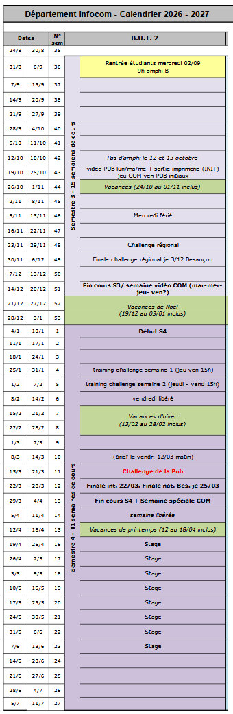

# Planning

!!! note "Trame à compléter"
    Les étapes ci-dessous reprennent les phases du projet ([Objectifs et livrables](index.md)), découpées en tâches plus précises, pour les jalons clés et l'étape cadrage. Les dates sont volontairement laissées vides : à renseigner en équipe dès la réunion de lancement.
	Un travail similaire est attendu pour toutes les étapes. Plus vous serez précis dans votre découpage de tâches et dans votre répartition, plus l'avancée de votre projet sera facile à suivre, et à corriger si certaines tâches venaient à s'éloigner des dates prévues.

## Jalons clés

Dates de passage d'une phase à l'autre / points de validation avec le tuteur.

!!! warning "Fin de votre 2° année "
	- Fin des cours de deuxième année en semaine 13 de l'année 2027
	- Soutenance de projet durant cette semaine
	- Précédée d'une semaine de challenge et d'une semaine spéciale pour les COM
	

| Jalon                                                        | Date prévue | Date réelle | Statut |
| ------------------------------------------------------------ | ----------- | ----------- | ------ |
| Réunion de lancement du projet                               |             |             | ⬜      |
| Répartition des rôles                                        |             |             | ⬜      |
| Validation de l'analyse préalable (cibles, audit, benchmark) |             |             | ⬜      |
| Validation de l'arborescence cible                           |             |             | ⬜      |
| Validation des maquettes / wireframes                        |             |             | ⬜      |
| Début de l'intégration Elementor                             |             |             | ⬜      |
| Recette finale                                               |             |             | ⬜      |
| Mise en production                                           |             |             | ⬜      |
| Soutenance / présentation finale                             |             |             | ⬜      |

!!! tip "Légende statut"
    ⬜ à venir · 🔄 en cours · ✅ terminé · ⚠️ en retard

## Détail des étapes par phase

### 1. Cadrage

| Étape                                                           | Début | Fin | Responsable | Statut |
| --------------------------------------------------------------- | ----- | --- | ----------- | ------ |
| Réunion de lancement avec le tuteur                             |       |     |             | ⬜      |
| Lecture du brief (ce site) par toute l'équipe                   |       |     |             | ⬜      |
| Répartition des rôles ([Équipe](equipe.md))                     |       |     |             | ⬜      |

### 2. Analyse préalable

### 3. Conception

### 4. Réalisation (Elementor)

### 5. Tests et recette

### 6. Livraison

!!! warning "Dépendances à anticiper"
    La phase **Réalisation** ne devrait démarrer qu'une fois l'arborescence cible et les maquettes validées (fin de phase **Conception**) — commencer l'intégration Elementor avant cette validation expose à devoir tout refaire. Idem, ne pas attendre la fin de l'intégration pour commencer les tests responsive : les vérifier en continu, page par page.
