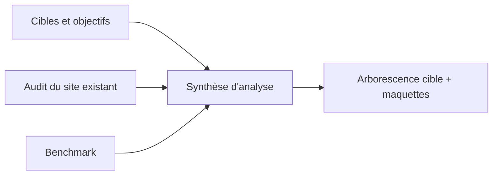

# Pourquoi analyser avant de refondre

## Le piège à éviter

Sur un projet de refonte de site web, l'erreur la plus fréquente est de se précipiter sur la maquette : ouvrir Elementor, choisir des couleurs et une mise en page, sans avoir d'abord répondu à des questions plus fondamentales.

!!! warning "Une refonte n'est pas un relookage"
    Refondre un site, ce n'est pas seulement le rendre « plus joli » ou « plus moderne ». C'est se demander : **à qui s'adresse ce site, pour faire quoi, et est-ce que sa version actuelle y arrive ?** Sans réponse à ces questions, même un design irréprochable peut rater sa cible.

## Les trois piliers de l'analyse préalable

Cette section contient trois trames à compléter en équipe, dans l'ordre suggéré ci-dessous :

1. **[Cibles et objectifs](cibles-objectifs.md)** — Qui visite (ou devrait visiter) le site, et pourquoi ? Quels sont les objectifs du site pour ses porteurs ?
2. **[Audit du site existant](audit-existant.md)** — Que contient le site actuel, qu'est-ce qui fonctionne, qu'est-ce qui ne fonctionne pas ?
3. **[Benchmark](benchmark.md)** — Comment d'autres sites comparables (autres départements/écoles, autres BUT info-com) traitent-ils ces mêmes enjeux ?

!!! tip "Méthodologie BUT Info-Com"
    Ce travail mobilise directement des compétences vues en cours (étude de public, sémiologie, communication digitale, UX). N'hésitez pas à réutiliser les outils et méthodes déjà vus en TD (personas, questionnaires, tris de cartes, etc.).

## Ce que cette analyse doit produire

À l'issue de cette phase, l'équipe doit être capable de répondre clairement à :

- Qui sont les 2-3 profils prioritaires visés par le site ?
- Quels sont les 3-5 objectifs principaux que le site doit remplir ?
- Quels contenus garder, modifier, supprimer, créer ?
- Quelle structure de navigation (arborescence) servira le mieux ces objectifs ?

Cette synthèse sert ensuite de base à la phase de [Refonte](../04-refonte/index.md).
